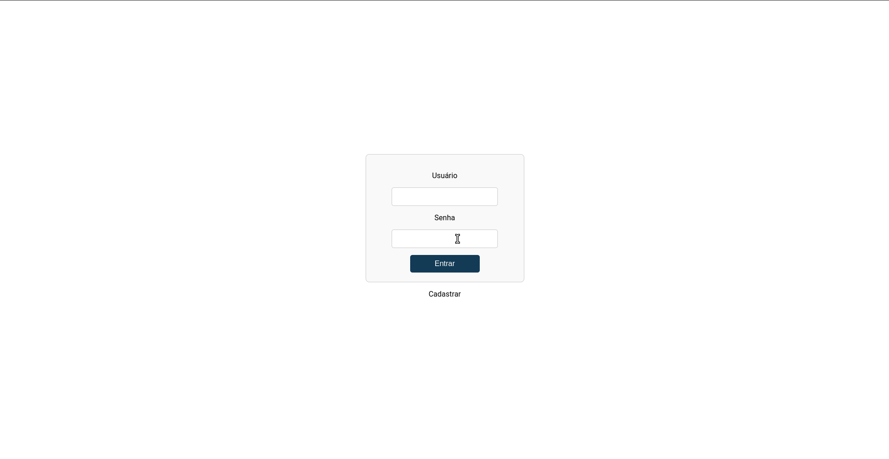

# Sistema de Controle de Caixa

Um sistema para contrle de caixa com autenticação.

## Funcionamento

O front foi desenvolvido para melhor apresentação do backend. É possível fazer login, cadastrar usuário, realizar
operações com caixa e cadastrar movimentação. As funções referentes a deletar e editar movimentação não foi implementada
via frontend, porém métodos existem.

## As telas

Abaixo é possível ver o funcionamento de forma geral.

  

## Como executar

Para requisição é necessário que o backend esteja funcionando, portanto verique o README.md do projeto completo ou do
backend em si. Em ambos é possível encontrar como executar o projeto.

Já para este, ele fará leitura do arquivo .env. Para fins de praticide, o mesmo foi versionado.

Note que no .env é informado o endereço do api. Está pode está executando tanto em docker quanto na IDE de sua
prerência, que não haverá mudança.

    No momento este não foi adicionado ao compose. Ainda.